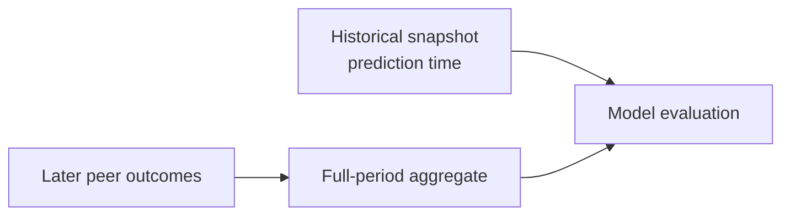

# Why I killed a 0.99 AUC model

**The metric was excellent. The prediction system was not.**

I built a customer-retention risk system whose evaluation became more convincing as I added contextual features. A point-in-time reconstruction showed that the result depended on information unavailable when each historical prediction would have been made. I rejected the headline, kept only narrower decisions worth testing independently, and changed the product boundary.

The failure mode is public and executable: run the [standard-library experiment](./leakage_demo/run_demo.py), inspect the [thin notebook](./leakage_demo/temporal_leakage_demo.ipynb), compare the checked-in [expected output](./leakage_demo/expected_output.json), or read the demo [README](./leakage_demo/README.md). For the documented synthetic seed, the leaky AUC rounds to 0.99; the honest cutoff AUC is 0.50.

> **Evidence boundary:** those numbers come only from generated data in this repository. The source-work account below is deliberately qualitative. The demo proves the leakage mechanism, not the performance of any non-public model or dataset.

This is a case study about judgment: when to stop optimizing a model and start questioning the evaluation.

## Why 0.99 looked credible

The result did not look like an obvious train/test mistake. The pipeline had labeled snapshots, separate train and holdout periods, class-imbalance handling, calibration, and feature explanations that fit the domain. Several iterations improved as context was added.

That context also made intuitive sense. An account's trajectory should be easier to interpret beside its segment, territory, and service history. Better context appeared to remove false alarms. The measurements and the domain story reinforced each other—which is why the result deserved a more hostile test.

The missing question was not “did this row belong to the holdout?” It was “could every value in this row have existed at the instant represented by the row?”

## The leak was in feature time

Several high-value features had been calculated across the full observation window and joined back onto historical snapshots. An earlier row could therefore see later peer behavior:

The account row could sit in the correct split while its cohort or lifetime aggregate still encoded the future. Cross-validation rewarded a signal that would not exist in a live prediction.

This is subtle because feature importance is not a leak detector. The problem is what a value knows, not how often a tree splits on it.

## The test that killed the result

I changed the unit of evaluation from held-out rows to historically available information. At each cutoff, the system had to rebuild source records, cohort membership, aggregate windows, features, and labels using only facts available by that time.

In plain language:

> Freeze the clock. Reconstruct what the system actually knew. Then ask it to predict what happened next.

Under that rule, the broad classifier lost the advantage that had made it look compelling. The discrepancy was too large to explain away as ordinary drift. The model had not earned the claim.

The public demo isolates the same causal failure. Its leaky peer feature reads the full generated panel. Its honest feature reads only pre-cutoff rows. A metamorphic check flips every post-cutoff label: the leaky feature changes and its score collapses, while the honest feature remains byte-for-byte unchanged. The verifier repeats the test across three seeds and independently computes every score from raw rows emitted by the runner.

## The decision

I stopped treating the flattering result as performance and recorded it as evidence of a failed evaluation.

That choice had three practical consequences:

- **No quiet metric substitution.** I did not swap in a friendlier chart or tune a threshold until the story looked useful.
- **No “mostly safe” broad classifier.** A system that cannot distinguish signal from future context should not prioritize customer outreach.
- **No erasing the failure.** The invalidation stays next to the impressive number so a reviewer cannot encounter one without the other.

Killing the result was cheaper than asking a customer-facing team to spend credibility on confident false alarms.

## What I kept instead

The failure did not imply that every predictive task was useless. It showed that “predict churn” was too broad a product and too forgiving an evaluation target.

I split the work into smaller decisions—ranking a reactivation opportunity, detecting a concrete decline, or deciding whether to monitor—and required each lane to survive its own temporal cutoff. I also added a product rule that mattered more than another decimal point: when current observed behavior contradicts a stale risk alarm, **ground truth** wins and the system falls back to monitoring.

The lesson was not to trust smaller models by default. It was to demand a specific decision, a declared information boundary, an honest baseline, and an explicit response when model evidence conflicts with current facts.

## What I would do before another deployment

1. Give every feature an event time, availability time, and allowed lookback.
2. Rebuild cohort aggregates inside every training fold and temporal cutoff.
3. Add future-perturbation tests: post-cutoff changes must not alter a pre-cutoff feature vector.
4. Compare each narrow task with simple baselines under the same cutoff.
5. Make model-versus-observation disagreement a first-class product state.

The most valuable output was not a score. It was a more trustworthy answer to a customer-facing question: **what evidence is strong enough to justify action right now?**
